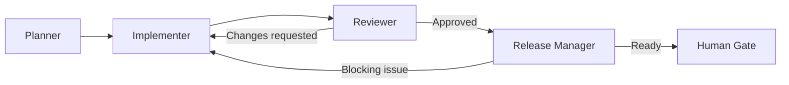

<!-- markdownlint-disable MD013 -->

# Agent Personas 🎭

General-purpose, non-speckit agent roles for teams that want a lightweight planner → implementer → reviewer → release-manager flow without adopting the full spec-kit ceremony.

All personas inherit governance from the [root AGENTS.md](../../../AGENTS.md) and [.github/copilot-instructions.md](../../copilot-instructions.md) - including British English, mandatory TDD, the `make lint && make test` quality gates, and ADR discipline.

## Handoff choreography

## Iteration caps

To prevent unbounded loops, the personas enforce explicit caps:

- **Implementer ↔ Reviewer:** at most **two correction cycles**. On entry to cycle three, the reviewer must stop and escalate to a human.
- **Release Manager → Implementer:** at most **one** return cycle. After that, a human gate is mandatory.
- **Planner:** at most **one** planning revision before the change must be confirmed by a human.

Any persona that cannot make progress within its cap stops and requests human input rather than retrying the same approach.

## Personas

| Persona         | File                                                 | One-line description                                                                             |
| --------------- | ---------------------------------------------------- | ------------------------------------------------------------------------------------------------ |
| Planner         | [planner.agent.md](planner.agent.md)                 | Turn a user goal into an actionable execution plan with acceptance criteria and a risk list.     |
| Implementer     | [implementer.agent.md](implementer.agent.md)         | Execute an approved plan, make the necessary code changes, and run the project's quality gates.  |
| Reviewer        | [reviewer.agent.md](reviewer.agent.md)               | Perform a strict code review with a bugs/regressions/tests-first mindset and enforce governance. |
| Release Manager | [release-manager.agent.md](release-manager.agent.md) | Final readiness check, changelog draft, and rollout/rollback notes before human approval.        |

## Discovery note

[`plugin.json`](../../../plugin.json) registers `.github/agents/` as the agents path. VS Code's agent loader may not recurse into subdirectories - behaviour at the time of writing is not formally documented. If the personas are not picked up automatically, either:

- flatten the persona files into `.github/agents/` (rename to keep the role unambiguous, for example `persona.planner.agent.md`); or
- extend `plugin.json` once the loader gains explicit nested-path support.

The repository's own discovery scripts (`apply.sh`, `import.sh`, the catalogue and folder-index generators) recurse into this subdirectory, so distribution and indexing work regardless of how VS Code resolves the files at runtime.

## Subagent markings

The [`planner.agent.md`](planner.agent.md) persona is marked with `subagent: true` and `user-invocable: false` in its frontmatter. It is intended to run as a read-only worker handed off from an orchestrating implementer or a human-driven workflow, not invoked directly. The other personas (`implementer`, `reviewer`, `release-manager`) remain coordinators - they own writes, decisions, or rollout gates - and stay user-invocable. See [`docs/architecture.md`](../../../docs/architecture.md) section "Subagent workers and lifecycle hooks" for the broader pattern and the matching `SubagentStart` / `SubagentStop` hooks.
