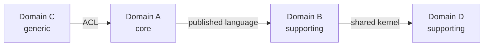

# Step 04 - Domain Analysis

Document domains, bounded contexts, and integration patterns (DDD-style, evidence-first).

## Goal

Create (or update) domain analysis documents at `.copilot/analysis/domain-*.md`.

Also ensure they are linked from the architecture overview at `.copilot/analysis/README.md`.

## Discovery (run before writing)

### A. Refresh what is already known

1. Re-read:
   - `.copilot/analysis/repository-map.md`
   - `.copilot/analysis/component-*.md`
   - `.copilot/analysis/runtime-flow-*.md`
2. Extract into working notes:
   - Component ownership (who owns which data/processes)
   - Datastores and entities each component owns
   - Inbound/outbound interfaces (HTTP, events, queues)
   - Integration surfaces and external services

### B. Locate domain boundaries (evidence-driven)

Look for evidence of bounded contexts in the codebase:

1. **Module/package boundaries** that suggest domain ownership (e.g. `accounts/`, `billing/`, `orders/`, `shipping/`).
2. **Aggregate roots and entities** with their own persistence and lifecycle.
3. **Ubiquitous language** in code (consistent terminology across a set of modules).
4. **Anti-corruption layers** (adapters/mappers between domain models and external schemas).
5. **Schema ownership** in datastores (which tables/collections belong to which module).
6. **Event names and topics** that indicate domain events (`OrderPlaced`, `PaymentCaptured`, etc.).

If domain boundaries are not explicit, record them as **Unknown from code - propose tentative boundaries based on {evidence}**.

## Steps

### 1) Select domains (explicit criteria)

1. Select up to **5** domains/bounded contexts that best represent the business.
2. Prefer domains that:
   - Own clearly distinct entities and lifecycles
   - Have their own persistence boundary
   - Are reflected in module/package structure
   - Emit/consume distinct domain events
3. Ensure coverage:
   - Core domain(s) (business differentiator)
   - Supporting domain(s) (necessary but not unique)
   - Generic domain(s) (commodity, often integrated externally)

### 2) Create one document per domain

For each domain, create `.copilot/analysis/domain-[XXX]-[name].md`, where:

- `[XXX]` is a stable numeric order
- `[name]` is short and meaningful (kebab-case)

Each domain document captures:

#### 2A. Domain identity

- Domain name
- Domain type: **core | supporting | generic**
- Bounded context name (if different)
- Owning components: link to `component-*.md`

#### 2B. Ubiquitous language

A short glossary of domain terms used in the codebase:

- Term | Definition | Where used (evidence link)

Only include terms that are present in code/config - do not invent terms.

#### 2C. Aggregates and entities

For each major aggregate:

- Aggregate root (entity name)
- Child entities and value objects
- Invariants enforced (if evidenced in code)
- Persistence location (table/collection/schema)
- Evidence links

#### 2D. Domain events

- Events emitted by this domain (name, schema/payload location, evidence)
- Events consumed from other domains (name, source domain, evidence)

#### 2E. Domain services and policies

- Domain services (operations that don't belong to a single entity)
- Policies / business rules (where enforced)
- Workflows (if explicit)

#### 2F. Integration patterns with other domains

Document how this domain integrates with others. Use DDD context-mapping vocabulary where evidenced:

- **Shared kernel:** shared types/contracts between this domain and another
- **Customer/supplier:** upstream/downstream relationship
- **Conformist:** this domain accepts upstream model as-is
- **Anti-corruption layer:** adapter that translates upstream model
- **Open host service:** this domain exposes a stable public protocol
- **Published language:** shared schema/event format
- **Separate ways:** no integration

For each integration, capture:

- Other domain (link to its `domain-*.md`)
- Pattern used (from list above)
- Direction (upstream/downstream/peer)
- Mechanism (HTTP/events/shared DB/file exchange)
- Evidence link

#### 2G. External integrations

- Third-party services this domain depends on
- Identity providers, payment gateways, messaging providers, etc.
- Evidence link

#### 2H. Data ownership and boundaries

- What data this domain owns (writes)
- What data it reads but does not own
- Any read models / projections it maintains
- Evidence links

#### 2I. Evidence (mandatory)

- File paths (URLs must be prefixed with `/`)
- Symbols, schemas, event names, config keys
- **Unknown from code - {suggested action}** where evidence is missing

### 3) Build a context map

In `.copilot/analysis/README.md`, add (or update) a **Domain Context Map** section with a single diagram showing all domains and the integration patterns between them.

Use a Mermaid flowchart:



Annotate each edge with the integration pattern.

### 4) Update the index

Update `.copilot/analysis/README.md` with a **Domain Analysis** section linking to every domain document (in `[XXX]` order), plus the context map.

### 5) Keep unknowns visible (no guessing)

- If a domain boundary is implied but not evidenced, record:
  - **Unknown from code - verify boundary / propose for review**
- If an integration is implied but not evidenced, record:
  - **Unknown from code - locate client/adapter/contract**

## Template snippet per domain

```markdown
# Domain {name}

- Type: {core | supporting | generic}
- Bounded context: {name}
- Owning components: [{component}](component-XXX-name.md)

## Ubiquitous language

| Term | Definition | Evidence      |
| ---- | ---------- | ------------- |
| ...  | ...        | [link](/path) |

## Aggregates and entities

### {Aggregate}

- Root: {entity}
- Children: ...
- Invariants: ...
- Persistence: {table/collection}
- Evidence: [link](/path)

## Domain events

### Emitted

- {EventName} – schema: [link](/path) – evidence: [link](/path)

### Consumed

- {EventName} (from {OtherDomain}) – evidence: [link](/path)

## Domain services and policies

- {Service/Policy}: ...

## Integration patterns

### With {OtherDomain}

- Pattern: {shared kernel | customer/supplier | conformist | ACL | OHS | published language | separate ways}
- Direction: {upstream | downstream | peer}
- Mechanism: {HTTP | events | shared DB | files}
- Evidence: [link](/path)

## External integrations

- {Service}: {purpose} – evidence: [link](/path)

## Data ownership

- Owns: {entities}
- Reads (does not own): {entities}
- Projections: ...

## Evidence

- Evidence: [path](/path#L10-L40) - {symbol/schema/event}
- Evidence: Unknown from code - {suggested action}
```
