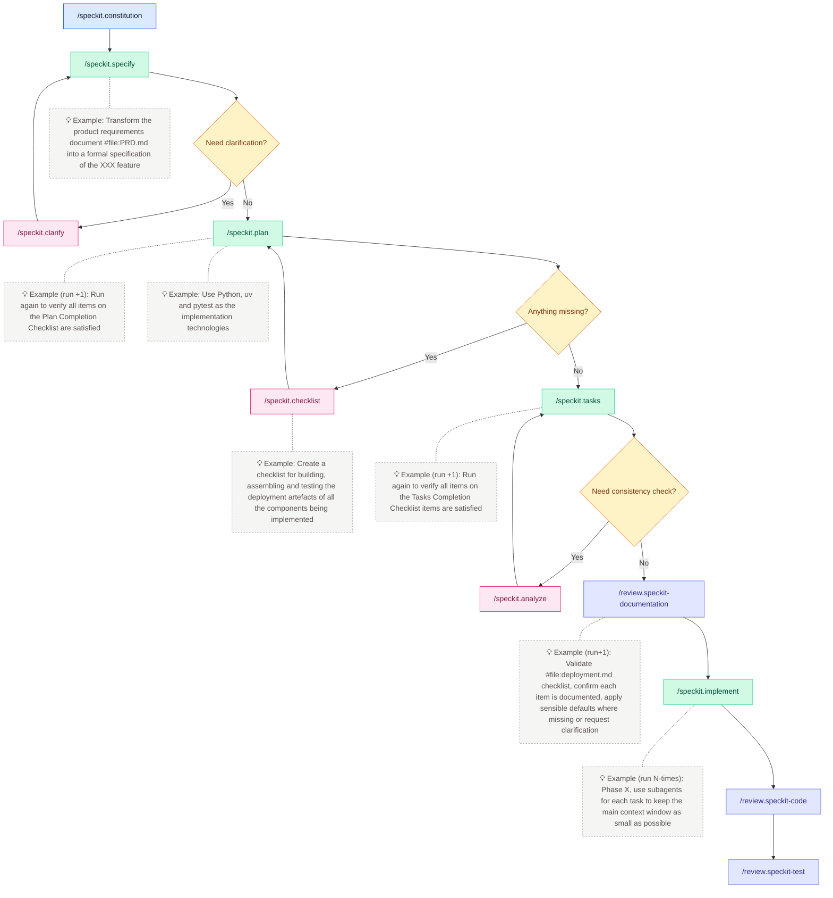

# GitHub Copilot Prompt Files

A curated, specification-first library of prompts, instruction packs, skills, and Copilot agents that keeps AI helpers aligned with the spec-kit operating model.

[](https://github.com/stefaniuk/promptfiles-copilot)
[](LICENCE.md)
[](./.github/contributing.md)

## Why this project exists

### Purpose

This library provides a central source of reusable prompts, instruction packs, skills, and Copilot agents for AI-assisted development workflows. It enables specification-driven development by keeping AI helpers aligned with a shared operating model.

### Benefit to the user

Teams gain consistent, deterministic automation across repositories. Copy-paste reuse makes onboarding faster, and governance gates ensure that specifications, code, and documentation stay synchronised.

### Problem it solves

Without shared prompt files, AI assistants drift from agreed standards, produce inconsistent outputs, and lack deterministic validation. Teams end up reinventing the same prompts and struggling to maintain alignment across projects.

### How it solves it (high level)

Prompts, agents, and skills are written directly against the spec-kit constitution. Instruction packs apply deterministic lint, test, and review rules. Every workflow leans on `make lint`, `make test`, and explicit governance gates, keeping behaviour measurable and testable.

## Quick start

### Prerequisites

- Git
- Make (GNU Make 3.82+)
- A text editor (VS Code recommended for Copilot integration)

### Setup

```bash
# Clone the repository
git clone https://github.com/stefaniuk/promptfiles-copilot.git
cd promptfiles

# Configure the development environment
make config

# Verify quality gates work
make lint && make test
```

### First run

Get up and running in minutes:

| Step  | Action                                                                                                              |
| :---: | ------------------------------------------------------------------------------------------------------------------- |
| **1** | ✂️ **Copy** the prompts or instruction packs you need straight into downstream repositories                         |
| **2** | 📦 **Install** instructions by copying guidance into `.github/instructions` so Copilot inherits rules automatically |
| **3** | 🤖 **Use** prompts under `.github/prompts` or agents under `.github/agents` to plan, spec, and review               |
| **4** | 🧪 **Validate** by running `make lint` and `make test` whenever you touch source material                           |
| **5** | 🧠 **Document** architectural reasoning in `docs/adr` for future context                                            |

**Expected output:** `make lint` and `make test` complete successfully with exit code 0.

## What it does

### Key features

- **Specification-first truth** — prompts, agents, and skills are written directly against the spec-kit constitution, so code, docs, and governance remain synchronised
- **Consistent guardrails** — instruction packs apply deterministic lint, test, and review rules across every repo, ensuring Copilot never drifts from agreed standards
- **Deterministic automation** — every workflow leans on `make lint`, `make test`, and explicit governance gates, keeping behaviour measurable and testable
- **Copy-ready building blocks** — everything is shippable by folder, making large organisations faster to onboard
- **Governance gates** — explicit checkpoints between specification and implementation

### Non-goals

- This library does not implement the underlying spec-kit framework itself
- It does not provide runtime execution environments for prompts
- It is not a replacement for language-specific linters or test frameworks

## How it works

The prompt library is organised into six customisation layers. Each layer builds on the one below, from governance foundations through to deterministic automation hooks.

```text
┌─────────────────────────────────────────────┐
│  Layer 5: Hooks (deterministic gates)       │
│  .github/hooks/*.json                       │
├─────────────────────────────────────────────┤
│  Layer 4: Skills (reusable capabilities)    │
│  .github/skills/*/SKILL.md                  │
├─────────────────────────────────────────────┤
│  Layer 3: Agents (personas + handoffs)      │
│  .github/agents/*.agent.md                  │
├─────────────────────────────────────────────┤
│  Layer 2: Prompts (one-off tasks)           │
│  .github/prompts/*.prompt.md                │
├─────────────────────────────────────────────┤
│  Layer 1: Instructions (standards + rules)  │
│  .github/instructions/*.instructions.md     │
│  .github/instructions/includes/*.include.md │
├─────────────────────────────────────────────┤
│  Layer 0: Governance (constitution + ADRs)  │
│  .specify/memory/constitution.md            │
│  docs/adr/                                  │
│  AGENTS.md                                  │
└─────────────────────────────────────────────┘
```

| Type             | When to use                                                   | When NOT to use                             |
| ---------------- | ------------------------------------------------------------- | ------------------------------------------- |
| **Instructions** | Coding standards, conventions, rules that apply to file types | Multi-step workflows, reusable capabilities |
| **Prompts**      | One-off tasks, quick operations, utility commands             | Complex workflows with supporting scripts   |
| **Agents**       | Persistent personas, tool-restricted roles, handoff chains    | Simple prompts that don't need tool control |
| **Skills**       | Reusable multi-step capabilities with scripts/resources       | Simple conventions or file-type rules       |
| **Hooks**        | Deterministic automation (lint, format, gates, audit)         | Advisory guidance, style preferences        |

## Spec-kit lifecycle

The spec-kit lifecycle follows a structured flow:

1. **Discover** the right prompt from the library
2. **Ground** it in a specification using agents like `/speckit.specify`
3. **Plan** the implementation with `/speckit.plan`
4. **Generate tasks** with `/speckit.tasks`
5. **Implement** with `/speckit.implement`
6. **Review** with governance gates (`/review.speckit-documentation`, `/review.speckit-code`, `/review.speckit-test`)
7. **Automate** every validation step with `make lint` and `make test`



## How to use

### Configuration

No additional configuration is required beyond the initial setup. The library uses convention over configuration with sensible defaults.

### Common workflows

#### Sync prompt files to a target repository

```bash
make apply dest=/absolute/path/to/target
```

<details>
<summary><strong>What gets copied?</strong></summary>

- `AGENTS.md`
- `.github/agents`, `.github/hooks`, `.github/instructions`, `.github/prompts`, `.github/skills`
- `.github/copilot-instructions.md`
- `.github/pull_request_template.md` (only if missing in the target)
- `.specify/memory/constitution.md`
- `scripts/hooks/`
- `.specify/scripts/bash`, `.specify/templates`
- `docs/adr/ADR-nnn_Any_Decision_Record_Template.md`
- `docs/architecture/`, `docs/prompts/`, `docs/.gitignore`
- `project.code-workspace` (only if missing in the target)

</details>

> **Next step:** Review git status in the target repo, commit, and run `make lint && make test`

#### Estimate context window usage

```bash
# Default: scan Copilot prompt files
make count-tokens

# Scan all markdown, sorted by size
make count-tokens args="--all --sort-by tokens"

# Target specific paths
make count-tokens args=".github/instructions .specify"
```

The report shows:

- **Tokens** — per-file token counts
- **No IDs** — counts with identifiers like `[ID-<prefix>-NNN]` stripped
- **Usage %** — context window usage (200K baseline)

#### Run governance gates

| Gate                   | Command                         | Purpose                                       |
| :--------------------- | :------------------------------ | :-------------------------------------------- |
| 📄 **Documentation**   | `/review.speckit-documentation` | Consistency across spec.md, plan.md, tasks.md |
| ✅ **Code Compliance** | `/review.speckit-code`          | Reconcile implementation with spec            |
| 🧪 **Test Quality**    | `/review.speckit-test`          | Ensure healthy test pyramid                   |
| 🧰 **Instructions**    | `/enforce.[tech]`               | Lint & test at every delivery phase           |

<details>
<summary><strong>Why governance gates matter</strong></summary>

- **Deterministic flow** — each gate blocks the next phase until resolved
- **Auditability** — checklist evidence for compliance reviews
- **Scalability** — repeatable tasks across dozens of teams
- **Fewer regressions** — catch integration issues early
- **Better onboarding** — contributors understand the lifecycle from tasks.md

</details>

#### Commit at each lifecycle stage

Each spec-kit stage produces artefacts worth committing. The table below maps every commit point in the flow diagram to a conventional commit message.

| Stage | Trigger                                                                                  | Conventional commit                                    |
| :---: | :--------------------------------------------------------------------------------------- | :----------------------------------------------------- |
|   1   | Constitution created or updated (`/speckit.constitution`)                                | `docs(constitution): establish project constitution`   |
|   2   | Specification drafted (`/speckit.specify`)                                               | `docs(spec): draft feature specification`              |
|   3   | Specification refined after clarification loop (`/speckit.clarify` → `/speckit.specify`) | `docs(spec): refine specification after clarification` |
|   4   | Implementation plan created (`/speckit.plan`)                                            | `docs(plan): draft implementation plan`                |
|   5   | Plan revised after checklist gap-fill (`/speckit.checklist` → `/speckit.plan`)           | `docs(plan): revise plan with checklist coverage`      |
|   6   | Tasks generated (`/speckit.tasks`)                                                       | `docs(tasks): generate implementation tasks`           |
|   7   | Tasks revised after consistency analysis (`/speckit.analyze` → `/speckit.tasks`)         | `docs(tasks): align tasks after consistency analysis`  |
|   8   | Documentation review passed (`/review.speckit-documentation`)                            | `docs(review): pass documentation review gate`         |
|   9   | Implementation completed (`/speckit.implement`, per phase)                               | `feat(feature): implement phase N`                     |
|  10   | Code review passed (`/review.speckit-code`)                                              | `refactor(review): address code review findings`       |
|  11   | Test review passed (`/review.speckit-test`)                                              | `test(review): address test review findings`           |

<details>
<summary><strong>Commit conventions explained</strong></summary>

- **Loops produce incremental commits.** Each pass through a clarify, checklist, or analyse loop can warrant its own commit when it changes artefacts materially. The table shows the "exit" commit — the one that locks in the stable artefact.
- **Multi-phase implementation.** Replace `phase N` with a descriptive label and `feature` with the feature name, e.g. `feat(checkout): implement phase 1 — data model`, `feat(checkout): implement phase 2 — API layer`.
- **Clean review gates.** If a review gate passes without triggering changes, fold it into the preceding commit. If it triggers fixes, use `refactor(review):` for code or `test(review):` for tests.
- **Scoping convention.** Every commit carries a scope: governance artefacts use `constitution`, `spec`, `plan`, `tasks`, or `review`; implementation commits use the feature name as the scope.

</details>

### Plugin installation

This repository can also be installed as a VS Code agent plugin, providing skills, agents, and hooks without needing `make apply`.

1. Open VS Code with Copilot agent mode enabled
2. Run `Cmd+Shift+P` → **Chat: Install Plugin From Source**
3. Enter the repository URL: `https://github.com/stefaniuk/awesome-copilot-promptfiles`

After installation, skills like `/enforcement-audit` and `/architecture-docs` appear as slash commands, and `speckit.*` agents appear in the agent dropdown.

> **Note:** Plugin installation provides skills, agents, and hooks only. For project-specific instructions, templates, and include baselines, use `make apply`.

### Examples

#### Featured artefacts

| Pack                                                                                                        | Description                                                                                                                                           |
| :---------------------------------------------------------------------------------------------------------- | :---------------------------------------------------------------------------------------------------------------------------------------------------- |
| 🤖 **[.github/agents](.github/agents)**                                                                     | Ready-to-run Copilot agents (analyze, checklist, clarify, constitution, implement, plan, specify, tasks, taskstoissues) tuned for spec-kit ceremonies |
| 💬 **[.github/prompts](.github/prompts)**                                                                   | Focused prompt files for documentation reviews, governance gates, tests, and refactoring support                                                      |
| 📋 **[.github/instructions](.github/instructions)**                                                         | Coding standards and best practice packs scoped by file glob so Copilot always sees the right rules                                                   |
| 🧠 **[.github/skills](.github/skills)**                                                                     | Bundled instructions plus helper assets that extend Copilot's capabilities for niche workflows                                                        |
| 📝 **[.specify/templates](.specify/templates)**                                                             | Seed specs, plans, and tasks for new features                                                                                                         |
| 📄 **[docs/adr/ADR-nnn_Any_Decision_Record_Template.md](docs/adr/ADR-nnn_Any_Decision_Record_Template.md)** | Opinionated ADR template aligned with spec-kit identifiers                                                                                            |

#### Prompt naming convention

Prompts use a **prefix + category + verb** convention to keep fuzzy search fast and predictable:

| Prefix          | Purpose                                         | Example                                    |
| :-------------- | :---------------------------------------------- | :----------------------------------------- |
| `speckit.`      | Spec-kit lifecycle steps                        | `speckit.plan.prompt.md`                   |
| `architecture.` | Evidence-first architecture documentation flows | `architecture.01-repository-map.prompt.md` |
| `enforce.`      | Instruction compliance enforcement              | `enforce.python.prompt.md`                 |
| `review.`       | Review and audit prompts                        | `review.speckit-code.prompt.md`            |
| `util.`         | Operational utilities                           | `util.gh-pr-review.prompt.md`              |

## Resources

- Custom Prompts — [VS Code Docs](https://code.visualstudio.com/docs/copilot/customization/prompt-files)
- Custom Instructions — [VS Code Docs](https://code.visualstudio.com/docs/copilot/customization/custom-instructions)
- Custom Agents — [VS Code Docs](https://code.visualstudio.com/docs/copilot/customization/custom-agents)
- Custom Skills — [VS Code Docs](https://code.visualstudio.com/docs/copilot/customization/agent-skills)
- Copilot Chat (macOS) — [Local setup guide](docs/prompts/vscode-copilot-chat-setup-macos.md)
- Awesome Copilot — [GitHub](https://github.com/github/awesome-copilot)

## Contributing

We welcome contributions! See [contributing.md](.github/contributing.md) for the full guide.

### Development setup

```bash
git clone https://github.com/stefaniuk/promptfiles-copilot.git
cd promptfiles
make config
```

### Quality commands

```bash
make lint   # Run linters (file format, markdown format, markdown links)
make test   # Run tests
```

### Quick checklist

1. **Raise an issue or PR** describing your planned changes
2. **Keep artefacts in sync** — specs, plans, tasks, and docs must align
3. **Run quality gates** — `make lint && make test` before opening a PR
4. **Follow the constitution** and NHS Engineering guidance

## Repository layout

- `AGENTS.md` — Cross-agent always-on instructions
- `.github/agents/` — Copilot agent definitions for spec-kit ceremonies
- `.github/hooks/` — Quality gate hook configurations for VS Code agent mode
- `.github/instructions/` — Coding standards by language/framework
- `.github/prompts/` — Task-specific prompt files
- `.github/skills/` — Bundled capabilities with supporting assets
- `.specify/` — Spec-kit templates and project constitution
- `docs/adr/` — Architecture decision records
- `scripts/` — Build and utility scripts

## Roadmap

<details>
<summary><strong>📝 New Prompts</strong></summary>

- `architecture-review.prompt` — architect for flow
- `migrate-from-[tech A]-to-[tech B].prompt`

</details>
<details>
<summary><strong>🔧 Workflow Prompts</strong></summary>

- **Release notes** — changelog entries grouped by spec identifiers

</details>

## Licence

This project is licensed under the MIT Licence. See [LICENCE.md](LICENCE.md) for details.
