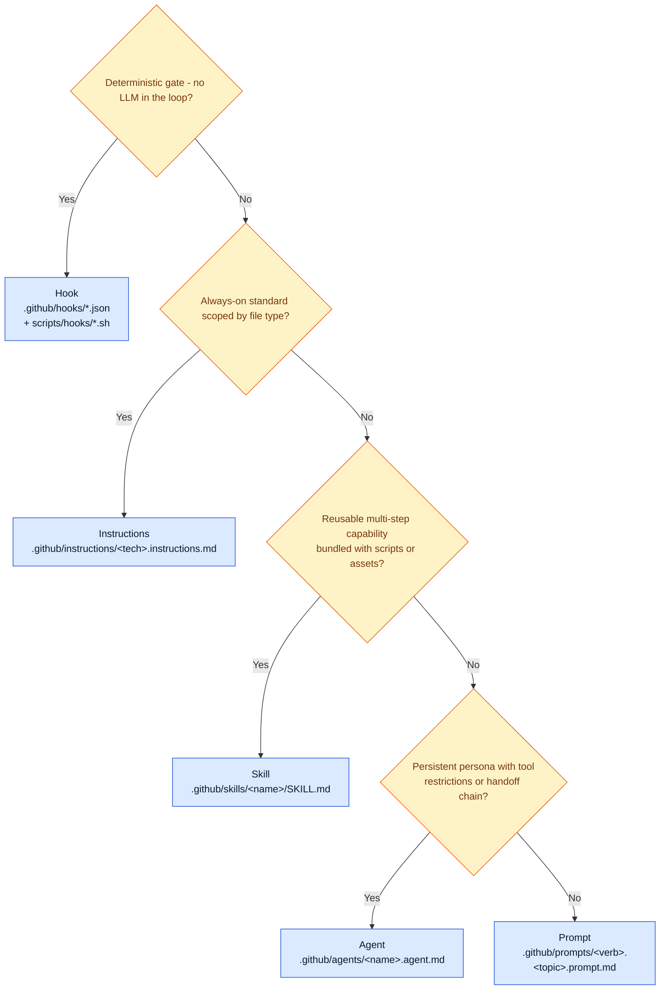
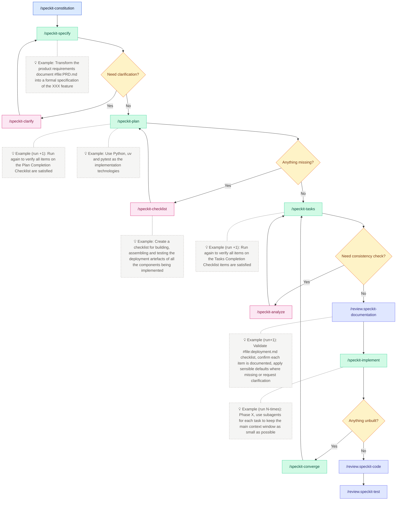

# Architecture 🏛️

> Linked from the [README](../README.md) under **How it works** and **Spec-kit lifecycle**. See also [docs/onboarding.md](onboarding.md) for the contributor walkthrough.

This document holds the deep architectural reference for the prompt library: the six-layer customisation model, the artefact type decision matrix, the spec-kit lifecycle, governance gates, and commit conventions per lifecycle stage.

## Six-layer customisation model

The prompt library is organised into six customisation layers. Each layer builds on the one below, from governance foundations through to deterministic automation hooks.

```text
┌─────────────────────────────────────────────┐
│  Layer 5: Hooks (deterministic gates)       │
│  .github/hooks/*.json                       │
├─────────────────────────────────────────────┤
│  Layer 4: Skills (reusable capabilities)    │
│  .github/skills/*/SKILL.md                  │
├─────────────────────────────────────────────┤
│  Layer 3: Agents (personas + handoffs)      │
│  .github/agents/*.agent.md                  │
├─────────────────────────────────────────────┤
│  Layer 2: Prompts (one-off tasks)           │
│  .github/prompts/*.prompt.md                │
├─────────────────────────────────────────────┤
│  Layer 1: Instructions (standards + rules)  │
│  .github/instructions/*.instructions.md     │
│  .github/instructions/includes/*.include.md │
├─────────────────────────────────────────────┤
│  Layer 0: Governance (constitution + ADRs)  │
│  .specify/memory/constitution.md            │
│  docs/adr/                                  │
│  .github/copilot-instructions.md            │
└─────────────────────────────────────────────┘
```

Each layer in detail:

- **Layer 0 - Governance.** The project constitution, ADRs, and [.github/copilot-instructions.md](../.github/copilot-instructions.md) set non-negotiable rules. Every other layer must honour them. Changes here are infrequent and reviewed deliberately.
- **Layer 1 - Instructions.** Coding standards scoped by file glob (for example `**/*.py`, `**/Dockerfile`). Copilot loads them automatically when relevant files are open, so they shape every suggestion. Shared baselines live in `.github/instructions/includes/`.
- **Layer 2 - Prompts.** One-off, copy-runnable tasks (documentation reviews, enforcement passes, utility commands). They reference instructions and skills but are invoked explicitly.
- **Layer 3 - Agents.** Persistent personas with tool restrictions and handoff chains. Repository personas such as `implementer`, `reviewer`, and `release-manager` live here.
- **Layer 4 - Skills.** Reusable multi-step capabilities bundled with helper scripts and resources. This layer includes the Spec Kit ceremonies (`speckit-specify`, `speckit-plan`, `speckit-tasks`, `speckit-implement`) alongside capabilities such as `architecture-docs`, `enforcement-audit`, and `code-review`.
- **Layer 5 - Hooks.** Deterministic automation that runs without an LLM in the loop: lint, format, link checks, and quality gates wired into the agent environment.

## Artefact type decision matrix

| Type             | When to use                                                   | When NOT to use                             |
| ---------------- | ------------------------------------------------------------- | ------------------------------------------- |
| **Instructions** | Coding standards, conventions, rules that apply to file types | Multi-step workflows, reusable capabilities |
| **Prompts**      | One-off tasks, quick operations, utility commands             | Complex workflows with supporting scripts   |
| **Agents**       | Persistent personas, tool-restricted roles, handoff chains    | Simple prompts that don't need tool control |
| **Skills**       | Reusable multi-step capabilities with scripts/resources       | Simple conventions or file-type rules       |
| **Hooks**        | Deterministic automation (lint, format, gates, audit)         | Advisory guidance, style preferences        |

### Artefact selection flowchart



Start at the top and walk down - the first matching branch wins. When more than one branch could plausibly apply, prefer the higher (leftmost in the answer order) branch, because hooks, instructions, and skills compose better than ad-hoc prompts. For per-artefact quickstarts (frontmatter, naming, validation steps), see [.github/contributing.md](../.github/contributing.md).

## Spec-kit lifecycle

The spec-kit lifecycle follows a structured flow that progresses through specification, planning, task generation, implementation, and three review gates. Clarification, checklist, and analysis loops feed back into earlier stages until the artefacts are coherent.

1. **Discover** the right prompt from the library.
2. **Ground** it in a specification using agents like `/speckit-specify`.
3. **Plan** the implementation with `/speckit-plan`.
4. **Generate tasks** with `/speckit-tasks`.
5. **Review documentation** with `/review.speckit-documentation`.
6. **Implement** with `/speckit-implement`.
7. **Converge** with `/speckit-converge` to verify completeness and gap remaining work.
8. **Review** with governance gates (`/review.speckit-code`, `/review.speckit-test`).
9. **Automate** every validation step with `make lint` and `make test`.



> **Optional pack.** The spec-kit lifecycle is packaged as an optional **speckit** plugin pack. Teams that do not use spec-kit can install just the core pack via `make apply dest=… subset=agents,hooks,instructions,prompts,skills,docs,project` (omitting `speckit` and `specify`). See [conventions.md#plugin-packs](conventions.md#plugin-packs) for the full boundary.

## Governance gates

Governance gates are explicit checkpoints between lifecycle stages. Each gate blocks the next phase until reviewers (human or agent) explicitly resolve findings.

| Gate                   | Command                         | Purpose                                       |
| ---------------------- | ------------------------------- | --------------------------------------------- |
| 📄 **Documentation**   | `/review.speckit-documentation` | Consistency across spec.md, plan.md, tasks.md |
| ✅ **Code Compliance** | `/review.speckit-code`          | Reconcile implementation with spec            |
| 🧪 **Test Quality**    | `/review.speckit-test`          | Ensure healthy test pyramid                   |
| 🧰 **Instructions**    | `/enforce.[tech]`               | Lint & test at every delivery phase           |

Why the gates matter:

- **Deterministic flow** - each gate blocks the next phase until findings are resolved.
- **Auditability** - checklist evidence supports compliance reviews.
- **Scalability** - repeatable tasks scale across dozens of teams.
- **Fewer regressions** - integration issues surface early.
- **Better onboarding** - contributors learn the lifecycle from `tasks.md`.

## Subagent workers and lifecycle hooks

The customisation catalogue distinguishes two roles:

- **Coordinators** drive a lifecycle stage end-to-end, write artefacts, and are user-invocable through their slash command. Examples: `/speckit-specify`, `/speckit-plan`, `/speckit-tasks`, `/speckit-implement`, `/speckit-converge`, plus the personas `implementer`, `reviewer`, `release-manager`.
- **Workers** are read-only or single-writer skills or agents that a coordinator delegates to for a bounded analysis. They are marked with `subagent: true` in their frontmatter; some additionally set `user-invocable: false` so they only run when explicitly handed off to.

Customisations currently marked as subagent workers:

- [`speckit-analyze`](../.github/skills/speckit-analyze/SKILL.md) - Non-destructive cross-artefact consistency check; should only be reached through the spec-kit pipeline.
- [`speckit-checklist`](../.github/skills/speckit-checklist/SKILL.md) - Appends checklist files (single-writer). Useful directly as well as via handoff.
- [`personas/planner`](../.github/agents/personas/planner.agent.md) - `subagent: true`, `user-invocable: false`. Explicitly read-only planner persona; runs as a worker for an orchestrating implementer or human-driven workflow.

Coordinators such as `speckit-clarify`, `personas/implementer`, `personas/reviewer`, and `personas/release-manager` are **not** marked as subagents: they own writes, decisions, or rollout gates and remain user-invocable.

The repository ships two lifecycle hooks that align with this worker/coordinator split:

- `SubagentStart` - [`scripts/hooks/subagent-start-context.sh`](../scripts/hooks/subagent-start-context.sh). Injects an `additionalContext` envelope identifying the worker and the most recently modified feature dir.
- `SubagentStop` - [`scripts/hooks/subagent-stop-log.sh`](../scripts/hooks/subagent-stop-log.sh). Records a one-line JSON event when the worker stops; never blocks completion.

Both hooks append structured records to `${COPILOT_PROMPT_LOG_DIR:-~/.local/state/copilot-prompts}/subagent-events.jsonl`, which gives a chronological trail of every subagent invocation alongside the existing `hooks.log` and daily prompt logs. The scripts also honour an explicit `LOG_DIR` override so the test harness can redirect output to a tempdir. They are registered in both [`hooks.json`](../hooks.json) (distributable copy) and [`.github/hooks/quality-gates.json`](../.github/hooks/quality-gates.json) (in-repo copy).

**Guardrails.** Workers are constrained to read-only tool sets or to a single-writer responsibility; coordinators are the only agents that orchestrate handoffs and trigger the `Stop` quality gate. This keeps the blast radius of a subagent invocation small and auditable.

**Discovery caveat.** VS Code's agent loader may not recurse into subdirectories - see the discovery note in [`.github/agents/personas/README.md`](../.github/agents/personas/README.md). The `subagent` marker is informational metadata that the repository's own tooling reads; it does not change how VS Code resolves the file at runtime.

## Commit conventions per lifecycle stage

Each spec-kit stage produces artefacts worth committing. The table maps every commit point in the flow diagram above to a conventional commit message.

| Stage | Trigger                                                                                  | Conventional commit                                    |
| ----- | ---------------------------------------------------------------------------------------- | ------------------------------------------------------ |
| 1     | Constitution created or updated (`/speckit-constitution`)                                | `docs(constitution): establish project constitution`   |
| 2     | Specification drafted (`/speckit-specify`)                                               | `docs(spec): draft feature specification`              |
| 3     | Specification refined after clarification loop (`/speckit-clarify` → `/speckit-specify`) | `docs(spec): refine specification after clarification` |
| 4     | Implementation plan created (`/speckit-plan`)                                            | `docs(plan): draft implementation plan`                |
| 5     | Plan revised after checklist gap-fill (`/speckit-checklist` → `/speckit-plan`)           | `docs(plan): revise plan with checklist coverage`      |
| 6     | Tasks generated (`/speckit-tasks`)                                                       | `docs(tasks): generate implementation tasks`           |
| 7     | Tasks revised after consistency analysis (`/speckit-analyze` → `/speckit-tasks`)         | `docs(tasks): align tasks after consistency analysis`  |
| 8     | Documentation review passed (`/review.speckit-documentation`)                            | `docs(review): pass documentation review gate`         |
| 9     | Implementation completed (`/speckit-implement`, per phase)                               | `feat(feature): implement phase N`                     |
| 10    | Convergence gap-fill after implementation (`/speckit-converge` → `/speckit-tasks`)       | `docs(tasks): append unbuilt work after convergence`   |
| 11    | Code review passed (`/review.speckit-code`)                                              | `refactor(review): address code review findings`       |
| 12    | Test review passed (`/review.speckit-test`)                                              | `test(review): address test review findings`           |

Commit conventions explained:

- **Loops produce incremental commits.** Each pass through a clarify, checklist, analyse, or converge loop can warrant its own commit when it changes artefacts materially. The table shows the "exit" commit - the one that locks in the stable artefact.
- **Multi-phase implementation.** Replace `phase N` with a descriptive label and `feature` with the feature name, for example `feat(checkout): implement phase 1 - data model`, `feat(checkout): implement phase 2 - API layer`.
- **Clean review gates.** If a review gate passes without triggering changes, fold it into the preceding commit. If it triggers fixes, use `refactor(review):` for code or `test(review):` for tests.
- **Scoping convention.** Every commit carries a scope: governance artefacts use `constitution`, `spec`, `plan`, `tasks`, or `review`; implementation commits use the feature name as the scope.

---

See also: [README](../README.md) · [Onboarding](onboarding.md)
